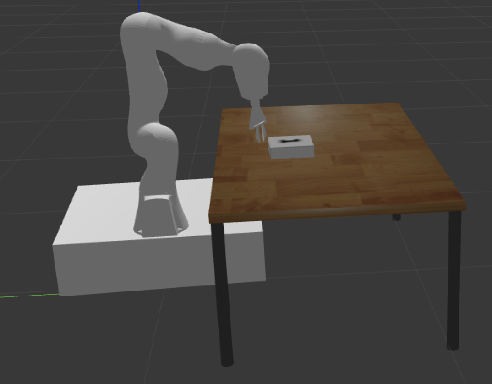

# Kuka_Mobile Robot
Kuka Manipulator placed on top of Mobile Base increasing it's reachability in many environments.

---

## Installation
Download the above kuka_mobile ros package or use this download [link](https://minhaskamal.github.io/DownGit/#/home?url=https://github.com/Suryachappidi/kuka_mobile_robot/tree/main/kuka_mobile)

* Note: 
    - Assuming your workspace is already created as `catkin_ws` in home dir.
    - Place the package kuka_mobile package in ~/catkin_ws/src folder

After Placing the package run the following commands to build the package
```
cd ~/catkin_ws/
catkin_make
devel/setup.bash
```

---

## Run
1. Run the following to launch the Kuka_mobile robot in the Gazebo world:
    ```
     cd ~/catkin_ws/src/kuka_mobile/launch
     roslaunch kuka_mobile.launch
    ```
2. On another terminal
    ```
     cd ~/catkin_ws/src/kuka_mobile/src
     python3 pick.py
    ```
3. Once robot reaches pickup position run the following to control mobile base of the robot.
    ```
     cd ~/catkin_ws/src/kuka_mobile/src
     python3 teleop_template.py
    ```
4. To control the kuka_manipulator via teleop
    ```
     cd ~/catkin_ws/src/kuka_mobile/src
     python3 endeffector_teleop.py
    ```
* Note: 
    - To control just manipulator using teleop close all current operations and just follow    Step 1 & 4

---

## About Executables:
* pick.py
    - Contains inverse kinematics of kuka_arm, so manipulator moves automatically to pickup position.
* teleop_template.py
    - Teleop of moving robot base
    - See the message printed on terminal after running to hit right keys
* endeffector_teleop.py
    - Contains inverse kinematics of kuka_arm, so manipulator can be controlled using keyboard.
    - See the message printed on terminal after running to hit right keys

---

## Gazebo Visulization
click [here](https://drive.google.com/drive/folders/1l-cRFRQRg2ed78VcFQnuLcueod6cRQPw?usp=share_link)



---

## Model
Robot modelling is done on solidworks, part and assembly files are present [here](kuka_mobile_CAD_models/)

---

## Depedencies
* ROS - noetic
* python3
* gazebo
* getch
* numpy
* sympy
* signals

### Installing Dependencies for Python

```
pip install -r requirements.txt
```
